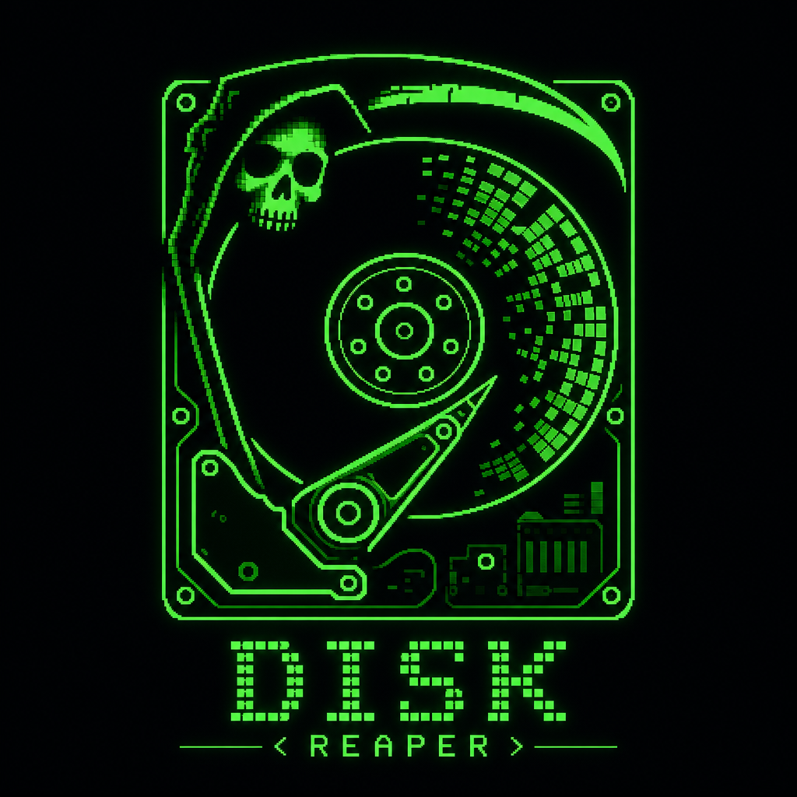

<div align="center">

# JSAY19 / DiskRepear



**DISK://REAPER** — анализатор дискового пространства для Windows

[](https://github.com/JSAY19/DiskRepear/releases/latest)
[](LICENSE)
[](https://www.microsoft.com/windows)
[](https://www.python.org/)
[](https://developer.microsoft.com/microsoft-edge/webview2/)

*Сканирует диск или папку, показывает самые тяжёлые файлы, находит мусор и дубликаты, помогает освободить место.*

[Скачать EXE](#-скачать) · [Использование](#%EF%B8%8F-использование) · [FAQ](#%EF%B8%8F-частые-вопросы) · [Сборка из исходников](#-сборка-из-исходников)

</div>

---

> [!IMPORTANT]
> ### ПРАВА АДМИНИСТРАТОРА
> Программа запрашивает **UAC (запуск от имени администратора)** — это нужно для удаления системных и защищённых файлов.
> Если отказаться от повышения прав, сканирование будет работать, но часть папок может быть недоступна.

> [!WARNING]
> ### АНТИВИРУСЫ И СБОРКА EXE
> Самосборный `.exe` (PyInstaller) иногда помечается антивирусом как **Potentially Unwanted** — это ложное срабатывание на упакованный Python-бинарник.
> Скачивайте релизы только со [страницы Releases](https://github.com/JSAY19/DiskRepear/releases) этого репозитория.
> При проблемах добавьте `DISK-REAPER.exe` в исключения антивируса.

> [!CAUTION]
> ### УДАЛЕНИЕ ФАЙЛОВ
> Перед удалением проверяйте список выбранных объектов (кнопка просмотра выделения).
> **«Уничтожить»** удаляет без возможности восстановления из корзины.
> Вкладки **Мусор** и **Дубликаты** используют эвристики — не всё помеченное обязательно можно удалять.

---

## 📥 Скачать

1. Откройте [**Releases**](https://github.com/JSAY19/DiskRepear/releases/latest)
2. Скачайте **`DISK-REAPER.exe`**
3. При необходимости: ПКМ → **Свойства** → **Разблокировать** → ОК
4. Запустите файл и подтвердите UAC

**На компьютере нужно:**
- Windows 10/11 (64-bit)
- [WebView2 Runtime](https://developer.microsoft.com/microsoft-edge/webview2/) — обычно уже установлен

Python ставить **не нужно**.

---

## ⚙️ Использование

1. Запустите **DISK-REAPER.exe** (или `python main.py` из исходников)
2. Выберите **диск** слева или нажмите **«Выбрать папку»**
3. Нажмите **«Запустить скан»** и дождитесь завершения
4. Изучите вкладки:
   - **TOP ФАЙЛЫ** — 100 самых больших файлов
   - **ПАПКИ** — дерево с размерами
   - **СТАТИСТИКА** — видео, архивы, документы…
   - **МУСОР** — temp, cache, logs и похожее
   - **ДУБЛИКАТЫ** — одинаковые файлы (поиск по MD5 после скана)
5. Отметьте ненужное → **В корзину** или **Уничтожить**

> [!TIP]
> Клик по строке выделяет файл. Зажмите ЛКМ и проведите по списку — массовое выделение.
> Кнопка **DIR** открывает файл в проводнике.

---

## ✨ Возможности

| Функция | Описание |
|--------|----------|
| 🔍 Сканирование | Любой диск или папка, фоновый поток, прогресс, отмена |
| 📊 TOP файлов | Крупнейшие файлы + фильтр по имени/расширению |
| 📁 Папки | Навигация с размерами подпапок |
| 📈 Статистика | Разбивка по типам: видео, архивы, код… |
| 🗑️ Мусор | Авто-поиск temp, cache, prefetch, thumbs.db |
| 📋 Дубликаты | Группы одинаковых файлов, «лишний» объём |
| 🧹 Удаление | В корзину (восстановимо) или безвозвратно |
| 🖥️ Интерфейс | Тёмная terminal-тема, кастомный title bar |

---

## 🗂️ Структура проекта

| Путь | Назначение |
|------|------------|
| [`main.py`](main.py) | Точка входа, окно pywebview, API Python ⇄ JS |
| [`scanner.py`](scanner.py) | Движок сканирования, мусор, дубликаты |
| [`ui/`](ui/) | HTML, CSS, JavaScript интерфейса |
| [`assets/`](assets/) | Иконка приложения |
| [`build.bat`](build.bat) | Сборка `DISK-REAPER.exe` |
| [`disk_reaper.spec`](disk_reaper.spec) | Конфигурация PyInstaller |

---

## 🛠️ Сборка из исходников

### Запуск для разработки

```powershell
git clone https://github.com/JSAY19/DiskRepear.git
cd DiskRepear
pip install -r requirements.txt
python main.py
```

### Сборка EXE

```powershell
build.bat
```

Или вручную:

```powershell
pip install -r requirements-build.txt
pyinstaller disk_reaper.spec --noconfirm --clean
```

Результат: **`dist\DISK-REAPER.exe`**

---

## ☑️ Частые вопросы

### Программа не запускается / белое окно

- Установите [WebView2 Runtime](https://developer.microsoft.com/microsoft-edge/webview2/)
- Запустите от имени администратора
- Проверьте, что Windows 10/11 64-bit

### Антивирус удалил EXE

- Добавьте файл в исключения
- Скачайте заново с официального [Releases](https://github.com/JSAY19/DiskRepear/releases)
- При сомнениях — соберите EXE сами из исходников (`build.bat`)

### Не удаляются некоторые файлы

- Запустите с правами администратора (UAC)
- Файл может быть занят другой программой — закройте её
- Системные файлы Windows лучше не трогать вручную

### Вкладка «Дубликаты» пустая долго

- Поиск дубликатов идёт **после** основного скана в фоне (MD5 по файлам одинакового размера)
- На больших дисках это может занять несколько минут

### Не нашли ответ

- Создайте [Issue](https://github.com/JSAY19/DiskRepear/issues)

---

## ⭐ Поддержка проекта

Поставьте **Star** репозиторию — так проект проще найти другим.

---

## ⚖️ Лицензирование

Проект распространяется на условиях лицензии [MIT](LICENSE).

---

<div align="center">

**DISK://REAPER** · made with Python + pywebview

</div>
